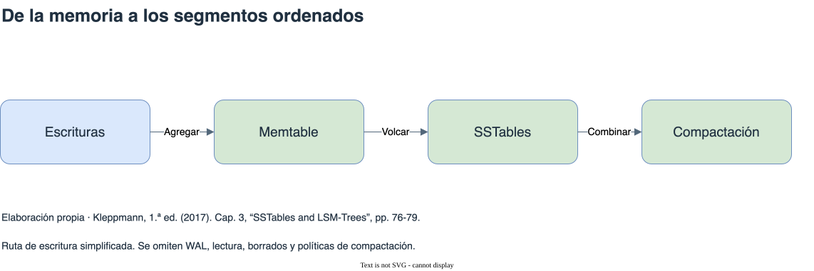

# Almacenamiento e índices

[Índice general](../README.md) · [Glosario](../glosario/README.md)

Fuente exclusiva: Kleppmann, primera edición de 2017. Páginas impresas del libro.

## Índice

- [Un índice cambia el costo del acceso](#un-índice-cambia-el-costo-del-acceso)
- [Índices hash y compactación](#índices-hash-y-compactación)
- [SSTables y LSM-trees](#sstables-y-lsm-trees)
- [B-trees y recuperación](#b-trees-y-recuperación)
- [Compromisos y otros índices](#compromisos-y-otros-índices)
- [Diagrama de apoyo](#diagrama-de-apoyo)

## Un índice cambia el costo del acceso

El ejemplo inicial del libro almacena pares clave-valor agregándolos al final de un archivo. Escribir resulta sencillo; encontrar el valor vigente requiere buscar la última aparición de la clave. El ejemplo muestra por qué una representación persistente necesita estructuras auxiliares para acelerar lecturas.

Un índice conserva información adicional que ayuda a localizar datos. Puede mejorar una consulta, pero cada escritura debe mantener los índices afectados. No existe un beneficio gratuito: se intercambian tiempo de lectura, trabajo de escritura y espacio.

Referencia: cap. 3, “Data Structures That Power Your Database”, pp. 70-72. Síntesis del pequeño almacén del libro, sin reproducir su implementación.

## Índices hash y compactación

El índice hash descrito mantiene en memoria la posición de cada clave en el archivo. Al agregar un valor, actualiza su posición; al leer, busca esa posición y recupera el dato. En este diseño, las claves del índice deben caber en memoria y las búsquedas por rango no aprovechan un orden.

El archivo se divide en segmentos para evitar su crecimiento indefinido. La compactación descarta versiones antiguas; la combinación de segmentos reúne los valores vigentes. Los registros de borrado deben impedir que reaparezcan valores antiguos al combinar segmentos.

El libro usa contadores de reproducciones de videos para mostrar muchas actualizaciones sobre un conjunto relativamente pequeño de claves. Ese patrón ayuda a entender tanto el índice en memoria como la utilidad de compactar.

Referencia: cap. 3, “Hash Indexes”, pp. 72-76.

## SSTables y LSM-trees

Una SSTable mantiene pares ordenados por clave. El orden facilita combinar archivos y permite usar un índice disperso: no hace falta guardar en memoria la posición de cada clave para acotar dónde buscar.

En el diseño del libro, las escrituras llegan primero a una estructura ordenada en memoria, la memtable. Un registro en disco permite recuperarla después de un fallo. Cuando alcanza cierto tamaño, se vuelca como SSTable. Las lecturas consultan la memoria y después los segmentos, empezando por los recientes; la compactación combina segmentos en segundo plano.

Esta familia de motores organiza buena parte del trabajo como escrituras secuenciales. Buscar una clave inexistente puede obligar a revisar varios archivos; los filtros de Bloom permiten descartar muchos de ellos. Un filtro puede dar falsos positivos, por lo que no sustituye la consulta del dato.

Referencia: cap. 3, “SSTables and LSM-Trees”, pp. 76-79.

## B-trees y recuperación

Los B-trees mantienen claves ordenadas en páginas de tamaño fijo. Las páginas internas dirigen la búsqueda hacia rangos y las hojas contienen valores o referencias. Insertar puede dividir páginas; actualizar suele modificar una página existente.

Un registro de escritura anticipada, WAL, permite recuperar cambios después de un fallo. La estructura también requiere control de concurrencia porque distintas operaciones pueden acceder a las mismas páginas. La implementación física y sus mecanismos de recuperación son parte del costo del índice.

Referencia: cap. 3, “B-Trees”, pp. 79-83.

## Compromisos y otros índices

Los LSM-trees pueden favorecer cargas de escritura, pero la compactación consume recursos y puede introducir demoras. Los B-trees pueden ofrecer lecturas más previsibles, pero actualizar páginas también genera trabajo adicional. Ambos pueden presentar amplificación de escritura: una escritura lógica causa varias escrituras físicas. Kleppmann advierte que el resultado depende de la implementación y la carga.

Un índice secundario permite buscar por campos distintos de la clave primaria. Un índice agrupado almacena los datos asociados; uno de cobertura guarda información suficiente para responder ciertas consultas sin recuperar la fila completa. Esa duplicación acelera algunas lecturas y aumenta el costo de mantenimiento.

Un índice compuesto ordena por una secuencia de campos. El ejemplo de la guía telefónica muestra que ordenar por apellido y luego nombre ayuda a buscar por apellido, pero no ofrece la misma ventaja al buscar solamente por nombre. Índices multidimensionales, de texto completo y difusos responden a necesidades diferentes.

Referencias: cap. 3, “Comparing B-Trees and LSM-Trees”, pp. 83-85; “Other Indexing Structures”, pp. 85-90. Las observaciones sobre motores concretos corresponden a 2017.

## Diagrama de apoyo

[Fuente editable](diagramas/lsm.drawio). Ruta de escritura simplificada. Se omiten WAL, lectura, borrados y políticas de compactación. Referencia: Cap. 3, “SSTables and LSM-Trees”, pp. 76-79.

## Continuación de la lectura

[Anterior: Modelo relacional y mapeo de objetos](../02-modelo-relacional/README.md) · [Siguiente: Transacciones y ACID](../04-transacciones-acid/README.md)
