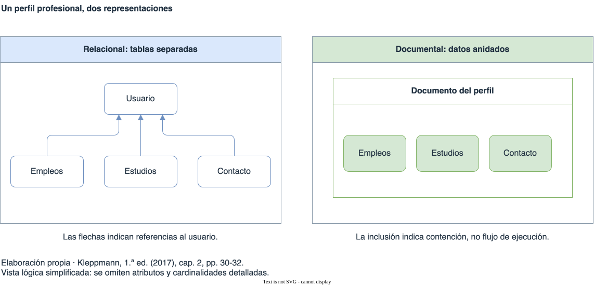

# Introducción a NoSQL

[Índice general](../README.md) · [Glosario](../glosario/README.md)

Capítulo piloto para revisar profundidad y estilo. Fuente exclusiva: Martin Kleppmann, *Designing Data-Intensive Applications*, primera edición de 2017, capítulo 2. Las páginas indicadas corresponden a la numeración impresa.

## Índice

- [El sentido de NoSQL](#el-sentido-de-nosql)
- [Del objeto al documento](#del-objeto-al-documento)
- [Las relaciones condicionan el modelo](#las-relaciones-condicionan-el-modelo)
- [Un esquema puede ser implícito](#un-esquema-puede-ser-implícito)
- [La localidad tiene condiciones](#la-localidad-tiene-condiciones)
- [Modelos y evolución](#modelos-y-evolución)
- [Criterios de comparación](#criterios-de-comparación)

## El sentido de NoSQL

NoSQL reúne sistemas con distintas decisiones de diseño. El término no identifica una tecnología única. Kleppmann sitúa su difusión en un encuentro de 2009 sobre bases distribuidas, no relacionales y de código abierto; posteriormente se reinterpretó como *Not Only SQL*.

El autor vincula su adopción con necesidades de escala y volumen de escrituras, preferencia por software libre, consultas especializadas y búsqueda de modelos más flexibles. Estas motivaciones explican el surgimiento de alternativas, pero no demuestran que cualquier sistema NoSQL resuelva mejor cualquier problema.

La elección depende de los requisitos de la aplicación. El libro plantea la coexistencia de sistemas relacionales y no relacionales, denominada **persistencia políglota**. Para EPERS, esto exige comparar las decisiones de cada modelo y las operaciones que facilita.

Referencia: cap. 2, “The Birth of NoSQL”, p. 29. El diagnóstico de adopción y la previsión de coexistencia pertenecen al contexto de la edición de 2017.

## Del objeto al documento

El modelo de objetos de una aplicación y el modelo de tablas, filas y columnas no coinciden directamente. Al persistir objetos en una base relacional, una capa debe traducir entre ambas representaciones. Kleppmann explica que un ORM como Hibernate reduce el código repetitivo, pero no elimina las diferencias entre modelos.

El libro ilustra el problema con un perfil profesional. El nombre corresponde a datos únicos del usuario; los empleos, estudios y medios de contacto forman colecciones de tamaño variable. Una representación relacional normalizada separa estas colecciones en tablas vinculadas al usuario. Una representación documental puede reunirlas en un documento anidado.

Si la aplicación obtiene el perfil completo, el documento concentra los datos necesarios. La representación relacional requiere combinar las tablas o efectuar varias consultas. La ventaja del documento surge aquí de la estructura del perfil y del acceso al conjunto, no de que JSON elimine por sí mismo todos los problemas de persistencia.

Referencia: cap. 2, “The Object-Relational Mismatch”, pp. 29-32. Síntesis de la figura 2-1, el ejemplo 2-1 y la figura 2-2, sin reproducir sus datos ni código.

### Dos representaciones del perfil

[Fuente editable en draw.io](diagramas/perfil-relacional-documental.drawio)

Diagrama de elaboración propia basado en “The Object-Relational Mismatch”, pp. 30-32. Compara la organización lógica de los mismos datos. Las flechas de la izquierda son referencias y el anidamiento de la derecha representa contención; no representan un flujo de ejecución. Se omiten atributos, identificadores y cardinalidades detalladas para concentrar la lectura en la separación o el anidamiento de las colecciones.

## Las relaciones condicionan el modelo

El perfil profesional deja de ser completamente autónomo cuando comparte información con otros perfiles. El libro usa regiones e industrias para mostrar una relación muchos a uno. Guardar una referencia a una entidad común permite mantener su nombre en un solo lugar. Repetir el texto en cada perfil obliga a actualizar varias copias cuando cambia y puede producir inconsistencias.

La incorporación de organizaciones, instituciones educativas y recomendaciones entre usuarios agrega conexiones. Una recomendación debe referenciar a su autor para reflejar cambios en su perfil. Estas relaciones atraviesan los límites de un documento.

El modelo documental representa bien árboles de relaciones uno a muchos. Las relaciones muchos a uno y muchos a muchos pueden exigir consultas adicionales o combinaciones entre entidades. Si la base no resuelve esas combinaciones, la aplicación asume el trabajo. La desnormalización puede reducirlas, a cambio de mantener coherentes las copias de información.

Para datos muy conectados, el libro presenta el modelo de grafos. Sus vértices representan entidades y sus aristas representan relaciones. Este piloto introduce esa distinción; los modelos de grafos y sus lenguajes tendrán un capítulo propio.

Referencias: cap. 2, “Many-to-One and Many-to-Many Relationships”, pp. 33-35; “Which data model leads to simpler application code?”, pp. 38-39; “Graph-Like Data Models”, pp. 49-50.

## Un esquema puede ser implícito

Describir una base documental como carente de esquema puede ocultar una dependencia: el código que lee los documentos suele esperar una estructura. Si la base no la exige al escribir, esa expectativa sigue existiendo en la aplicación.

Kleppmann distingue dos enfoques:

| Enfoque | Dónde se interpreta o exige la estructura |
| --- | --- |
| Esquema en lectura, *schema-on-read* | El consumidor interpreta la estructura cuando lee los datos. |
| Esquema en escritura, *schema-on-write* | La base exige que los datos escritos respeten un esquema explícito. |

El libro muestra una evolución del perfil que pasa de un campo de nombre completo a campos separados. Con esquema en lectura, pueden coexistir documentos antiguos y nuevos; el lector debe tratar ambas representaciones. Con esquema en escritura, el cambio puede involucrar una modificación del esquema y una migración de datos. El autor también señala que una base relacional puede posponer la transformación de valores hasta la lectura.

La flexibilidad resulta útil cuando los registros tienen estructuras heterogéneas o cuando sistemas externos determinan su formato. Cuando los registros deben compartir una estructura, el esquema explícito permite documentarla y exigirla. El libro no establece un ganador universal entre ambos enfoques.

Referencia: cap. 2, “Schema flexibility in the document model”, pp. 39-41. Síntesis del ejemplo de evolución del nombre, sin reproducir su código. Los comentarios de esa sección sobre costos de cambios de esquema en productos concretos describen el contexto de 2017.

## La localidad tiene condiciones

La localidad consiste en almacenar juntos datos que se necesitan juntos. En el ejemplo del perfil, acceder a gran parte del documento puede evitar búsquedas independientes para reconstruirlo.

El beneficio cambia si la consulta necesita solo una parte pequeña de un documento grande. Según las características de almacenamiento que describe el libro, cargar el documento completo puede desperdiciar trabajo; una actualización puede requerir reescribirlo. Por eso, el tamaño del documento y los patrones de lectura y escritura forman parte de la comparación.

La localidad tampoco es exclusiva del modelo documental. Kleppmann menciona mecanismos de agrupamiento en sistemas relacionales y en modelos de familias de columnas. No basta con clasificar una base como relacional o documental para deducir su organización física.

Referencia: cap. 2, “Data locality for queries”, p. 41. Las observaciones sobre carga y reescritura corresponden a los sistemas descritos en la edición; no constituyen una afirmación universal sobre todos los motores actuales.

## Modelos y evolución

El libro recupera la discusión histórica sobre modelos jerárquicos, de red y relacionales. Los árboles simplifican ciertos agrupamientos, pero dificultan representar conexiones que atraviesan sus límites. El modelo de red CODASYL exigía recorrer caminos de acceso; cambiar esos caminos podía obligar a modificar las consultas de la aplicación. En el modelo relacional, el optimizador decide el acceso físico para resolver la consulta.

Las bases documentales comparten con el modelo jerárquico el anidamiento de registros. Eso no implica que reproduzcan el funcionamiento de CODASYL: tanto documentos como tablas pueden representar conexiones mediante identificadores y resolverlas al leer.

Kleppmann también observa una convergencia entre documentos y relaciones: algunos motores relacionales incorporan soporte para documentos y algunos sistemas documentales incorporan operaciones de combinación. Esta observación pertenece al panorama de 2017. Sirve para separar el modelo de datos de las capacidades concretas de cada producto.

Referencias: cap. 2, “Are Document Databases Repeating History?”, pp. 36-38; “Convergence of document and relational databases”, pp. 41-42.

## Criterios de comparación

La comparación del capítulo se concentra en el modelo de datos. La tolerancia a fallos y el manejo de concurrencia requieren estudiar replicación y transacciones por separado.

| Aspecto | Compromiso que presenta el libro |
| --- | --- |
| Estructura de los datos | Un árbol autocontenido favorece la representación documental; las conexiones entre entidades requieren evaluar referencias y combinaciones. |
| Complejidad de la aplicación | Reunir datos anidados puede simplificar el código; resolver relaciones fuera de la base puede complicarlo. |
| Esquema | La flexibilidad permite heterogeneidad, pero el lector asume expectativas y compatibilidad. Un esquema explícito documenta y exige una estructura. |
| Acceso y localidad | Almacenar juntos datos consultados juntos puede ayudar; documentos grandes y accesos parciales cambian ese balance. |

Referencia: cap. 2, “Relational Versus Document Databases Today”, pp. 38-42.

La etiqueta NoSQL no alcanza para elegir una estrategia de persistencia. En el razonamiento de Kleppmann, la estructura de los datos, sus relaciones y las operaciones de la aplicación determinan qué compromisos conviene examinar.

## Continuación de la lectura

[Anterior: Aislamiento y serializabilidad](../05-aislamiento/README.md) · [Siguiente: Bases documentales](../07-bases-documentales/README.md)
