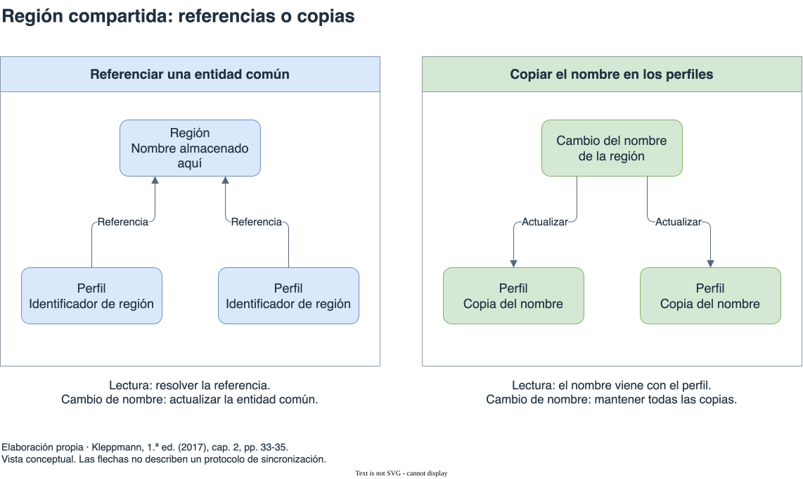

# Bases documentales

[Índice general](../README.md) · [Glosario](../glosario/README.md)

Fuente exclusiva: Kleppmann, primera edición de 2017. Páginas impresas del libro.

## Índice

- [El documento como agrupamiento](#el-documento-como-agrupamiento)
  - [El árbol del perfil y su lectura completa](#el-árbol-del-perfil-y-su-lectura-completa)
  - [El límite del documento es una decisión del modelo](#el-límite-del-documento-es-una-decisión-del-modelo)
- [Anidar o referenciar](#anidar-o-referenciar)
  - [Tres relaciones del mismo perfil](#tres-relaciones-del-mismo-perfil)
  - [Seguir una actualización de información compartida](#seguir-una-actualización-de-información-compartida)
  - [Ahorrar consultas puede aumentar escrituras](#ahorrar-consultas-puede-aumentar-escrituras)
- [Esquema y evolución](#esquema-y-evolución)
  - [El lector también tiene un contrato](#el-lector-también-tiene-un-contrato)
  - [Del nombre completo a campos separados](#del-nombre-completo-a-campos-separados)
  - [Cuándo ayuda la heterogeneidad](#cuándo-ayuda-la-heterogeneidad)
- [Localidad y tamaño](#localidad-y-tamaño)
  - [Localidad para una consulta concreta](#localidad-para-una-consulta-concreta)
  - [Actualizaciones y crecimiento](#actualizaciones-y-crecimiento)
  - [La localidad también existe fuera de los documentos](#la-localidad-también-existe-fuera-de-los-documentos)
- [MongoDB dentro del alcance del libro](#mongodb-dentro-del-alcance-del-libro)
  - [Modelo, codificación y producto](#modelo-codificación-y-producto)
- [Diagrama de apoyo](#diagrama-de-apoyo)

## El documento como agrupamiento

Un documento permite representar datos anidados, con estructuras y colecciones dentro de un registro. En el perfil profesional del libro, empleos y estudios se agrupan con los datos del usuario. Esa representación hace explícito un árbol de relaciones uno a muchos.

El agrupamiento puede simplificar la reconstrucción del objeto de la aplicación. Pero el documento debe evaluarse junto con sus operaciones: obtenerlo completo, consultar una parte y modificarlo tienen costos distintos. No equivale automáticamente a la unidad de consistencia de todas las relaciones del dominio.

Referencia: cap. 2, “The Object-Relational Mismatch”, pp. 29-32.

### El árbol del perfil y su lectura completa

La estructura del perfil del libro tiene una raíz: el usuario. De ella dependen sus empleos, estudios y contactos. Cada colección puede tener un tamaño distinto sin requerir que todos los perfiles contengan la misma cantidad de elementos.

Al anidar esas colecciones, el documento hace explícita la relación de pertenencia. Recuperar el perfil completo obtiene juntas las partes del árbol. En el ejemplo relacional, reconstruirlo requiere reunir registros que están en tablas diferentes mediante consultas o joins.

La cercanía con la estructura de la aplicación puede reducir el código de reconstrucción. El beneficio es mayor cuando la operación habitual necesita buena parte de ese árbol. Si las consultas se centran en conexiones entre distintos perfiles, la conveniencia inicial no resuelve esas conexiones.

Referencia: cap. 2, “The Object-Relational Mismatch”, pp. 29-32; “Which data model leads to simpler application code?”, pp. 38-39.

### El límite del documento es una decisión del modelo

En el perfil, un empleo pertenece a la historia de una persona, pero la organización puede aparecer en muchos perfiles. Anidar los datos del empleo no obliga a copiar toda la organización dentro de él. El modelo puede combinar una parte anidada con una referencia compartida.

Una colección dentro del documento tiene un camino desde la raíz. El libro señala que referenciar directamente un elemento anidado es menos simple que identificar un registro independiente: puede necesitarse indicar el documento y una posición o camino dentro de él. Esa limitación ayuda a distinguir el contenido que se usa como parte del perfil de una entidad que otros datos deben referenciar por sí misma.

El anidamiento moderado puede ser adecuado para datos que forman un árbol. Cuando las relaciones cruzan sus límites, hay que elegir cómo resolverlas. Guardar el árbol completo no transforma todas las entidades conectadas en partes privadas del usuario.

Referencia: cap. 2, “Comparison to document databases”, p. 38; “Which data model leads to simpler application code?”, pp. 38-39. Las limitaciones descritas corresponden al panorama de la edición de 2017.

## Anidar o referenciar

El perfil incluye regiones e industrias compartidas. Guardar sus nombres en cada documento repite información; usar identificadores mantiene una referencia a una entidad común. La incorporación de organizaciones y recomendaciones entre usuarios vuelve más conectado el modelo.

Anidar datos que se consultan juntos puede evitar combinaciones. Referenciar entidades compartidas permite actualizarlas en un lugar, pero exige resolver esas referencias al leer. El libro destaca que tanto documentos como tablas pueden utilizar identificadores: la diferencia no consiste en que uno admita relaciones y el otro no.

Si el motor no combina los registros, la aplicación puede realizar varias consultas. Esa solución traslada complejidad y puede aumentar viajes de red. Desnormalizar reduce algunas consultas, pero obliga a mantener las copias coherentes.

Referencias: cap. 2, “Many-to-One and Many-to-Many Relationships”, pp. 33-35; “Comparison to document databases”, p. 38; “Which data model leads to simpler application code?”, pp. 38-39.

### Tres relaciones del mismo perfil

| Relación | Qué describe | Consecuencia para el agrupamiento |
| --- | --- | --- |
| Usuario y empleos | Una persona puede registrar varios empleos. | La colección puede formar parte del árbol del perfil. |
| Perfiles y región | Muchos perfiles señalan una misma región. | Una entidad compartida evita repetir su información legible. |
| Usuarios y recomendaciones | Un usuario puede escribir y recibir recomendaciones. | Las referencias conectan distintos perfiles. |

Los documentos resuelven de manera directa la primera estructura. Las otras introducen referencias que no quedan resueltas por el anidamiento. El libro usa esa evolución para mostrar por qué el modelo debe evaluarse cuando aparecen nuevas funciones.

La normalización no es exclusiva de tablas. Un documento que guarda un identificador de región ya separa la referencia de la información compartida. La lectura necesita resolverla, independientemente del formato del registro que contiene ese identificador.

Referencia: cap. 2, “Many-to-One and Many-to-Many Relationships”, pp. 33-35; “Comparison to document databases”, p. 38.

### Seguir una actualización de información compartida

Si cada perfil contiene el nombre de la región como texto, un cambio del nombre afecta todos esos documentos. Modificar solo algunos deja varias representaciones de la misma información. Si los perfiles guardan el identificador de una entidad común, el nombre puede modificarse allí.

La lectura debe obtener entonces el nombre referido. El motor puede resolverlo mediante sus capacidades de consulta; si no lo hace, la aplicación realiza consultas adicionales. El libro observa que listas pequeñas y de pocos cambios pueden mantenerse en memoria, pero incluso en ese caso el trabajo de combinación existe y queda a cargo de la aplicación.

El ejemplo de recomendaciones produce una consecuencia similar. Copiar nombre y foto del autor simplifica recuperar la recomendación, pero obliga a actualizar esas copias cuando cambia el perfil. Referenciar al autor evita repetir esa información y agrega una resolución al leer.

Referencia: cap. 2, “Many-to-One and Many-to-Many Relationships”, pp. 33-35.

### Ahorrar consultas puede aumentar escrituras

| Elección | Qué gana | Qué paga |
| --- | --- | --- |
| Anidar información usada con el perfil | Recuperarla junto con el resto del árbol. | Acoplar su acceso a la estructura y al tamaño del documento. |
| Referenciar una entidad compartida | Mantener una representación común y una identidad estable. | Resolver la referencia al consultar. |
| Duplicar información compartida | Evitar algunas combinaciones durante la lectura. | Propagar actualizaciones y afrontar posibles copias incoherentes. |

Una consulta adicional puede implicar otro viaje de red. Evitarla es una ganancia concreta, pero debe compararse con la frecuencia de cambios y con la cantidad de copias que habrá que mantener. El libro no atribuye simplicidad universal a ningún modelo.

Referencia: cap. 2, “Which data model leads to simpler application code?”, pp. 38-39; “Convergence of document and relational databases”, pp. 41-42.

## Esquema y evolución

La ausencia de un esquema exigido por la base no implica ausencia de expectativas. El lector necesita interpretar campos y tipos. Kleppmann denomina esquema en lectura a esa estructura implícita y lo contrasta con un esquema explícito exigido al escribir.

El ejemplo del nombre completo y su separación en campos ilustra la coexistencia de representaciones antiguas y nuevas. Si no se transforma todo de una vez, el lector debe reconocer ambas. La flexibilidad cambia dónde se afronta la compatibilidad; no elimina el trabajo.

La heterogeneidad puede justificar esa flexibilidad, especialmente cuando fuentes externas controlan el formato. Si todos los registros deben respetar una estructura común, un esquema explícito puede documentarla y protegerla.

Referencia: cap. 2, “Schema flexibility in the document model”, pp. 39-41.

### El lector también tiene un contrato

Si el código espera un nombre, una lista de empleos y una región, existe una expectativa sobre la estructura aunque la base no la valide. Un documento puede ser aceptado para almacenamiento y aun así no cumplir lo que necesita ese lector.

Schema-on-read describe dónde se interpreta esa estructura. Schema-on-write hace explícita una definición que se aplica al escribir. La diferencia afecta cuándo se detectan incompatibilidades y qué componentes deben afrontarlas.

La analogía del libro con tipos dinámicos y estáticos ayuda a entender el tradeoff. Aceptar estructuras heterogéneas permite incorporar datos sin imponer una forma única desde el principio. A cambio, el consumidor debe saber cuáles puede interpretar. Una estructura exigida al escribir puede restringir variaciones, pero documenta y protege un formato común.

Referencia: cap. 2, “Schema flexibility in the document model”, pp. 39-41.

### Del nombre completo a campos separados

El ejemplo de evolución parte de un campo que contiene el nombre completo. La aplicación pasa a escribir campos separados y conserva un tratamiento para documentos anteriores.

1. Los documentos existentes mantienen su representación original.
2. Las escrituras nuevas usan la estructura nueva.
3. El lector comprueba si encuentra el campo nuevo.
4. Si falta y existe el anterior, interpreta la representación antigua y obtiene el dato que necesita.

Así pueden coexistir documentos de distintas generaciones. Se evita una transformación inmediata de toda la colección, pero se mantiene una rama de compatibilidad en el lector. Diferir la reescritura redistribuye trabajo en el tiempo; no convierte automáticamente todos los registros a la forma nueva.

La separación del nombre en el libro es un ejemplo de cambio de formato. Su operación simplificada no pretende resolver todos los nombres personales. Lo que ilustra es la posibilidad de reconocer datos anteriores al cambio.

El libro muestra también una opción relacional gradual: agregar una columna y completar su valor al leer si una actualización masiva no resulta aceptable. Por eso, migración gradual y modelo documental no son sinónimos.

Referencia: cap. 2, “Schema flexibility in the document model”, pp. 40-41. Síntesis del ejemplo de evolución, sin reproducir el código.

### Cuándo ayuda la heterogeneidad

El libro menciona colecciones con distintos tipos de objetos y datos cuyo formato depende de sistemas externos. En esos casos, obligar a todas las entradas a ajustarse inmediatamente a una estructura única puede introducir trabajo o impedir conservar información útil.

Si todos los registros deben tener la misma estructura, la falta de validación no aporta necesariamente una ventaja. El código sigue esperando campos comunes. Un esquema explícito puede hacer visible esa expectativa y evitar guardar registros que la incumplan.

La flexibilidad exige precisar qué varía y quién controla esa variación. Puede tratarse de distintos tipos de datos o de varias versiones del mismo tipo. Son motivos distintos, aunque ambos necesiten lectores capaces de interpretar más de una forma.

Referencia: cap. 2, “Schema flexibility in the document model”, pp. 40-41.

## Localidad y tamaño

Almacenar juntos datos necesarios para una misma lectura puede reducir búsquedas. En el perfil, ese beneficio aparece cuando se recupera buena parte de su información. Si se necesita solamente un campo de un documento muy grande, cargarlo completo puede resultar costoso.

El libro también describe actualizaciones que requieren reescribir el documento y advierte sobre aumentar su tamaño. Estas observaciones pertenecen a los mecanismos de la edición de 2017. No deben convertirse en una regla idéntica para cualquier motor o versión.

La localidad puede conseguirse también mediante otros modelos y estructuras físicas. Es necesario separar el formato lógico de los datos de las decisiones del motor que los almacena.

Referencia: cap. 2, “Data locality for queries”, p. 41.

### Localidad para una consulta concreta

La localidad relaciona la ubicación de los datos con la operación que los necesita. Si el perfil completo está almacenado junto, una lectura puede evitar búsquedas separadas de sus colecciones. El beneficio aparece porque la consulta necesita esas partes al mismo tiempo.

Consultar solo un campo pequeño cambia la comparación. Si el motor debe cargar un documento grande para devolver ese campo, puede leer mucha información que la aplicación no utiliza. En la descripción del libro, la agrupación que favorece la página completa puede resultar costosa para esa consulta parcial.

La cantidad de solicitudes al motor y la cantidad de datos que se procesan son medidas diferentes. Una solicitud que obtiene un documento grande puede realizar más trabajo que varias búsquedas pequeñas. Contar viajes de red ayuda a describir un costo, pero no agota la comparación.

Referencia: cap. 2, “Data locality for queries”, p. 41.

### Actualizaciones y crecimiento

El libro describe documentos codificados como una secuencia contigua de bytes. Una modificación que conserva el tamaño codificado puede permitir una actualización en el lugar. Cuando el tamaño cambia, reescribir o reubicar esa representación puede exigir más trabajo.

Esto conecta la estructura con el patrón de escritura. Agregar elementos a una colección anidada puede hacer crecer el documento. La ventaja de recuperarla junto con el perfil debe analizarse junto con el costo de sus modificaciones.

| Operación | Beneficio o costo que señala el libro |
| --- | --- |
| Leer buena parte del documento | Aprovecha que los datos se encuentran juntos. |
| Leer una parte pequeña de un documento grande | Puede cargar contenido que no se necesita. |
| Modificar aumentando el tamaño codificado | Puede exigir reescritura de la representación completa. |

Estas son explicaciones del almacenamiento descrito en 2017. No constituyen una afirmación sobre todos los motores documentales ni sobre sus implementaciones actuales.

Referencia: cap. 2, “Data locality for queries”, p. 41.

### La localidad también existe fuera de los documentos

El libro presenta técnicas relacionales que agrupan físicamente datos relacionados y familias de columnas que buscan una localidad semejante. Los ejemplos muestran que la estructura visible para la aplicación no determina por completo la ubicación física.

Una representación relacional puede disponer filas relacionadas cerca unas de otras. Un documento ofrece un agrupamiento lógico claro, pero sus índices y mecanismos físicos también importan. Comparar únicamente tablas frente a JSON puede dejar fuera la parte que explica el costo real de la lectura.

Para profundizar en ese segundo nivel, [Almacenamiento e índices](../03-almacenamiento-indices/README.md) distingue páginas, archivos ordenados y estructuras auxiliares. Allí el tradeoff se expresa en lecturas físicas, reescrituras y espacio.

Referencia: cap. 2, “Data locality for queries”, p. 41.

## MongoDB dentro del alcance del libro

MongoDB aparece como ejemplo de base orientada a documentos y BSON como una codificación utilizada para almacenarlos. La sección de convergencia comenta funciones y comportamiento de productos de la época. No se extrapolan esas afirmaciones a versiones actuales.

Este capítulo cubre el modelo documental, no una guía de comandos, índices específicos ni transacciones de MongoDB. Las garantías generales de concurrencia se estudian en [Aislamiento](../05-aislamiento/README.md), y la distribución en [Replicación](../10-replicacion/README.md) y [Partición](../11-particion/README.md).

Referencias: cap. 2, “The Object-Relational Mismatch”, p. 31; “Data locality for queries” y “Convergence of document and relational databases”, pp. 41-42.

### Modelo, codificación y producto

JSON describe una forma de representar estructuras anidadas. BSON es una codificación binaria mencionada para MongoDB. El modelo documental describe cómo se agrupan y relacionan los datos. Son niveles vinculados, pero elegir una codificación no determina todas las capacidades de consulta o de concurrencia.

El perfil puede expresarse como documento y almacenarse en un motor documental. El libro también describe soporte para documentos en motores relacionales. Ese soporte permite combinar datos anidados con otras capacidades del motor.

Al estudiar la convergencia, conviene identificar la capacidad concreta: consultar campos internos, indexarlos o resolver referencias. Las listas de productos y sus restricciones pertenecen a la primera edición. El capítulo usa esas menciones para explicar el modelo y conserva ese alcance histórico.

Referencias: cap. 2, “The Object-Relational Mismatch”, pp. 30-32; “Convergence of document and relational databases”, pp. 41-42.

## Diagrama de apoyo

[Fuente editable](diagramas/referencias-copias.drawio). Comparación conceptual de lectura y actualización de la región. Las flechas indican referencias o actualizaciones, según su etiqueta; no describen un protocolo de sincronización. Elaboración propia. Referencia: cap. 2, “Many-to-One and Many-to-Many Relationships”, pp. 33-35.

## Continuación de la lectura

[Anterior: Introducción a NoSQL](../06-introduccion-nosql/README.md) · [Siguiente: Bases orientadas a grafos](../08-grafos/README.md)
