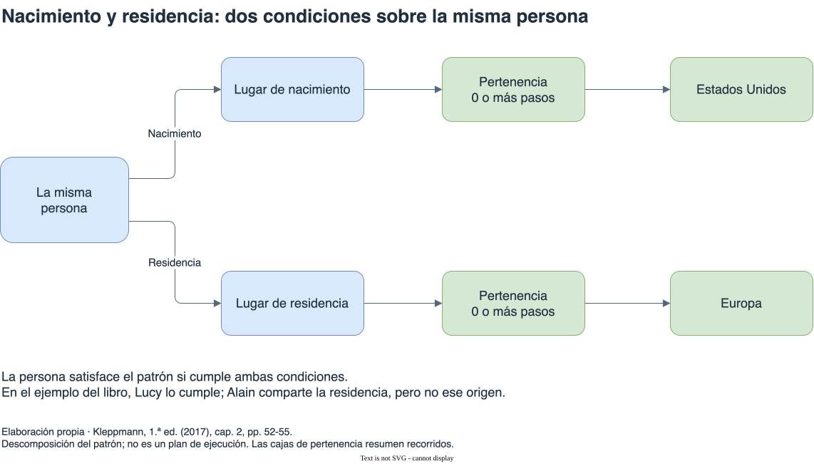

# Bases orientadas a grafos

[Índice general](../README.md) · [Glosario](../glosario/README.md)

Fuente exclusiva: Kleppmann, primera edición de 2017. Páginas impresas del libro.

## Índice

- [Entidades y conexiones](#entidades-y-conexiones)
  - [Qué conserva una conexión explícita](#qué-conserva-una-conexión-explícita)
  - [Leer el ejemplo geográfico por partes](#leer-el-ejemplo-geográfico-por-partes)
- [Grafos de propiedades](#grafos-de-propiedades)
  - [Vértices, aristas y propiedades cumplen tareas diferentes](#vértices-aristas-y-propiedades-cumplen-tareas-diferentes)
  - [La dirección del vínculo y la dirección del recorrido](#la-dirección-del-vínculo-y-la-dirección-del-recorrido)
  - [Extender las conexiones sin forzar una jerarquía uniforme](#extender-las-conexiones-sin-forzar-una-jerarquía-uniforme)
- [Cypher y recorridos variables](#cypher-y-recorridos-variables)
  - [Descomponer el patrón que busca la consulta](#descomponer-el-patrón-que-busca-la-consulta)
  - [Por qué la longitud variable evita una lista fija de joins](#por-qué-la-longitud-variable-evita-una-lista-fija-de-joins)
  - [Empezar por personas o por lugares](#empezar-por-personas-o-por-lugares)
- [Triples, RDF y SPARQL](#triples-rdf-y-sparql)
  - [Un triple puede expresar una propiedad o una relación](#un-triple-puede-expresar-una-propiedad-o-una-relación)
  - [RDF y sus distintas representaciones](#rdf-y-sus-distintas-representaciones)
  - [Consultar un camino con SPARQL](#consultar-un-camino-con-sparql)
- [Datalog y reglas reutilizables](#datalog-y-reglas-reutilizables)
  - [Distinguir hechos guardados de resultados derivados](#distinguir-hechos-guardados-de-resultados-derivados)
  - [Reutilizar una relación en varias consultas](#reutilizar-una-relación-en-varias-consultas)
  - [Comparar según la estructura que se consulta](#comparar-según-la-estructura-que-se-consulta)
- [Diagrama de apoyo](#diagrama-de-apoyo)

## Entidades y conexiones

Cuando las relaciones muchos a muchos son frecuentes, un grafo permite tratar las conexiones como parte explícita del modelo. Los vértices representan entidades; las aristas, relaciones. Los tipos de entidad pueden ser heterogéneos dentro de un mismo grafo.

Kleppmann usa personas y lugares para conectar nacimiento, residencia y pertenencia geográfica. Lucy nació en Idaho y vive en Londres; Alain nació en Beaune y también vive en Londres. Los lugares pueden estar contenidos en otras regiones, con distinta cantidad de niveles. El ejemplo permite estudiar recorridos sin fijar una profundidad idéntica para todos los datos.

Referencia: cap. 2, “Graph-Like Data Models”, pp. 49-50. Síntesis del ejemplo de Lucy y Alain, sin copiar la figura.

### Qué conserva una conexión explícita

En una red social, la conexión permite expresar quién conoce a quién. En la web, representa un enlace entre páginas. En una red vial, une cruces mediante caminos. El libro usa esos casos para mostrar que un grafo describe relaciones que pueden recorrerse y analizarse.

No todos los vértices necesitan representar el mismo tipo de entidad. Un mismo grafo puede contener personas y lugares, con etiquetas de relación que distingan nacimiento, residencia y pertenencia geográfica. La estructura reúne información heterogénea sin exigir que cada conexión tenga el mismo significado.

La cantidad de relaciones por sí sola no explica toda la elección. Importa también si las consultas necesitan seguirlas, cuántos niveles pueden atravesar y cómo cambia esa estructura. El libro presenta el grafo como un modelo natural cuando los datos están muy conectados.

Referencia: cap. 2, “Graph-Like Data Models”, pp. 49-50.

### Leer el ejemplo geográfico por partes

Lucy nació en Idaho y vive en Londres. Alain nació en Beaune y también vive en Londres. La residencia compartida no implica el mismo origen. Las conexiones mantienen separados esos hechos.

Los lugares se vinculan con regiones mayores. La consulta del libro busca personas nacidas dentro de Estados Unidos que viven dentro de Europa. Debe usar el lugar vinculado por nacimiento para la primera condición y el vinculado por residencia para la segunda.

La granularidad tampoco es uniforme. El nacimiento de Lucy se expresa con un estado y su residencia con una ciudad. El recorrido de pertenencia permite alcanzar regiones mayores desde ambos niveles. No hace falta convertir todos los lugares a una misma cantidad de escalones.

Referencia: cap. 2, “Graph-Like Data Models” y “Property Graphs”, pp. 49-52.

## Grafos de propiedades

En un grafo de propiedades, los vértices tienen identificadores y propiedades. Las aristas tienen origen, destino, etiqueta y propiedades propias. El modelo permite recorrer conexiones entrantes o salientes y añadir nuevos tipos de relación.

El libro muestra que también puede representarse un grafo mediante tablas de vértices y aristas. La representación lógica del grafo y el lenguaje cómodo para consultarlo son cuestiones relacionadas, pero diferentes. Neo4j aparece como implementación del modelo de propiedades en el panorama de 2017.

Referencia: cap. 2, “Property Graphs”, pp. 50-52. No se reproduce el esquema SQL del ejemplo.

### Vértices, aristas y propiedades cumplen tareas diferentes

| Elemento | Información que aporta | Papel en el ejemplo |
| --- | --- | --- |
| Vértice | Identidad y propiedades de una entidad. | Representar una persona o un lugar. |
| Arista | Origen, destino y etiqueta de una conexión. | Vincular persona y lugar mediante nacimiento o residencia. |
| Propiedad | Un valor asociado a un vértice o una arista. | Guardar el nombre de un lugar o el de una persona. |

Un nombre legible no reemplaza la identidad del vértice. Las conexiones apuntan a la entidad; sus propiedades permiten describirla. La etiqueta de la arista conserva el significado de la relación y evita confundir residencia con nacimiento.

Las aristas del modelo tienen identidad y pueden llevar propiedades propias. Esto permite describir información de la conexión, además de la de sus extremos. El modelo distingue la entidad de la relación que la vincula con otra.

Referencia: cap. 2, “Property Graphs”, pp. 50-51.

### La dirección del vínculo y la dirección del recorrido

Una arista tiene origen y destino. Eso no obliga a consultar el grafo únicamente en esa dirección. El libro describe acceso a conexiones entrantes y salientes para recorrerlo en ambos sentidos.

Desde Lucy puede seguirse el nacimiento hacia Idaho. Desde Idaho pueden buscarse las personas cuyas aristas de nacimiento llegan allí. La relación guardada conserva el mismo significado; cambia el punto de partida de la consulta.

El ejemplo relacional del libro guarda vértices y aristas en tablas. Cada arista conserva los identificadores de sus extremos, y los índices sobre ambos extremos permiten localizar las conexiones entrantes o salientes. Esa representación demuestra que un grafo lógico puede persistirse en tablas.

La diferencia que se estudia después es cómo expresar consultas cómodamente, especialmente cuando la longitud del recorrido cambia entre datos. Representar una arista como fila no impide el recorrido, pero tampoco ofrece por sí solo una sintaxis concisa para describirlo.

Referencia: cap. 2, “Property Graphs”, pp. 50-52; “Graph Queries in SQL”, pp. 53-55.

### Extender las conexiones sin forzar una jerarquía uniforme

El libro compara estructuras regionales diferentes y niveles de información distintos. El grafo puede incorporar esos lugares y relaciones sin imponer que cada país tenga exactamente la misma secuencia de subdivisiones.

También propone agregar información de alergias, alérgenos y alimentos mediante nuevos vértices y conexiones. La extensión utiliza el mismo mecanismo de entidades y relaciones, aunque introduce otro tipo de consulta.

La flexibilidad estructural no define automáticamente el significado de una arista. Las etiquetas deben distinguir las relaciones que necesita la aplicación. Lo que gana el modelo es poder incorporar conexiones nuevas sin obligar a que todo quede subordinado a un único árbol.

Referencia: cap. 2, “Property Graphs”, pp. 51-52. La posibilidad de extensión sintetiza el ejemplo del libro; no es una guía sanitaria.

## Cypher y recorridos variables

Cypher expresa patrones que deben satisfacer los vértices y las relaciones. La consulta del libro busca personas nacidas en Estados Unidos que viven en Europa. Para resolverla, parte del lugar de nacimiento o residencia y sigue relaciones de pertenencia geográfica.

El número de niveles varía: un lugar puede ser ciudad, estado o país. Expresar un recorrido de longitud variable evita enumerar una cantidad fija de combinaciones. En SQL, el ejemplo utiliza consultas recursivas para expresar el mismo razonamiento; no es imposible representar el grafo relacionalmente, pero la consulta resulta más extensa.

Referencias: cap. 2, “The Cypher Query Language”, pp. 52-53; “Graph Queries in SQL”, pp. 53-55.

### Descomponer el patrón que busca la consulta

La consulta geográfica aplica dos condiciones a la misma persona. La primera sigue nacimiento y pertenencia hasta Estados Unidos. La segunda sigue residencia y pertenencia hasta Europa. El resultado reúne nombres de quienes satisfacen ambas.

1. Identificar una persona y su lugar de nacimiento.
2. Comprobar que ese lugar pertenece a Estados Unidos mediante las conexiones geográficas necesarias.
3. Identificar el lugar donde vive esa misma persona.
4. Comprobar su pertenencia a Europa.
5. Obtener el nombre si se satisfacen las dos condiciones.

Ese orden ayuda a leer el razonamiento; no obliga al motor a ejecutarlo en esa secuencia. El lenguaje declarativo expresa el patrón y deja al optimizador elegir una estrategia.

Lucy satisface el patrón descrito. Alain comparte la residencia, pero su lugar de nacimiento pertenece a Francia, por lo que no satisface la condición de origen estadounidense. Evaluar ambas ramas sobre la misma persona evita combinar el origen de una con la residencia de otra.

Referencia: cap. 2, “The Cypher Query Language”, pp. 52-53; “The Foundation: Datalog”, pp. 61-62.

### Por qué la longitud variable evita una lista fija de joins

Una persona puede tener una conexión de residencia directamente a la región buscada o a un lugar contenido en ella. En el segundo caso hay que continuar por las relaciones de pertenencia. La consulta del libro admite cero o más pasos de ese tipo.

Cero pasos cubre el caso de apuntar directamente al destino geográfico. Uno o más cubren lugares intermedios. Una lista fija de niveles podría omitir datos que usan otra profundidad o requerir alternativas adicionales para cada forma de la jerarquía.

SQL puede expresar ese recorrido con una consulta recursiva. El libro muestra que la comparación es de expresividad y extensión de la consulta, no de imposibilidad del modelo relacional. El patrón de grafo permite formular de manera más directa la cantidad variable de relaciones.

Referencia: cap. 2, “The Cypher Query Language”, pp. 52-53; “Graph Queries in SQL”, pp. 53-55.

### Empezar por personas o por lugares

El libro describe dos estrategias para el mismo patrón. Una empieza por personas y comprueba su nacimiento y residencia. Otra encuentra los vértices de Estados Unidos y Europa, recorre hacia lugares contenidos y busca las personas conectadas a ellos.

Un índice sobre nombres puede ayudar a encontrar los lugares iniciales. La conveniencia de cada recorrido depende de los datos y de las estructuras disponibles. La consulta declarativa permite elegir un plan sin cambiar el resultado que se pide.

El tradeoff de ceder esa elección es parecido al de SQL: el código expresa las condiciones y el motor decide detalles del acceso. Usar un patrón corto no garantiza poco trabajo; describe el resultado con menos dependencia de una secuencia manual.

Referencia: cap. 2, “The Cypher Query Language”, p. 53.

## Triples, RDF y SPARQL

Un triple contiene sujeto, predicado y objeto. El sujeto corresponde a una entidad; el objeto puede ser un valor simple o una segunda entidad. Así, los triples expresan tanto propiedades como conexiones.

RDF define un modelo que puede representarse con diferentes sintaxis. SPARQL consulta datos de ese modelo mediante patrones. Kleppmann utiliza otra vez el recorrido entre nacimiento, residencia y región para comparar la expresión de una misma consulta.

El libro distingue estos mecanismos de la promesa más amplia de la web semántica. No es necesario adoptar toda esa visión para comprender un almacén de triples o su lenguaje de consulta.

Referencia: cap. 2, “Triple-Stores and SPARQL”, pp. 55-60.

### Un triple puede expresar una propiedad o una relación

Si el objeto del triple es un valor simple, el sujeto recibe una propiedad. Si el objeto identifica otra entidad, el triple describe una conexión. El predicado distingue qué significa esa información.

En el ejemplo geográfico, el nombre de un lugar es un valor; su pertenencia a otro lugar es una conexión. Ambos pueden representarse como triples. La estructura uniforme permite consultar propiedades y relaciones con patrones de un mismo lenguaje.

El grafo de propiedades y el almacén de triples comparten la idea de entidades conectadas, pero no son formatos idénticos. El libro usa la comparación para explicar cómo información semejante puede expresarse mediante vocabularios y lenguajes diferentes.

Referencia: cap. 2, “Triple-Stores and SPARQL”, pp. 55-57; “The SPARQL query language”, p. 59.

### RDF y sus distintas representaciones

Turtle y RDF/XML son formas de escribir datos RDF. Cambiar la sintaxis no cambia por sí solo el conjunto de relaciones que esos datos representan. El libro muestra una representación más compacta y otra más extensa del mismo contenido.

RDF utiliza identificadores y espacios de nombres para distinguir términos. Dos fuentes pueden usar una palabra parecida con significados diferentes; un identificador que incluye el espacio de nombres evita tratarlos automáticamente como el mismo predicado.

Ese mecanismo responde a la combinación de datos de distintas fuentes. A cambio, introduce convenciones de identificación que deben conservarse al interpretar los datos. Una URI usada como nombre no tiene que ser una página que pueda abrirse en el navegador.

Referencia: cap. 2, “The RDF data model”, pp. 57-58.

### Consultar un camino con SPARQL

SPARQL expresa la consulta de nacimiento estadounidense y residencia europea usando patrones sobre triples y recorridos de pertenencia. Las variables vinculan las distintas condiciones a la misma persona.

La consulta vuelve a separar origen y residencia. Una ruta encuentra la región correspondiente al nacimiento; otra, la correspondiente al lugar donde vive. El patrón permite utilizar relaciones intermedias sin fijar una cantidad única de niveles.

El libro presenta el uso interno de triples y SPARQL independientemente de la visión amplia de la web semántica. Adoptar ese modelo no obliga a publicar los datos en una base global ni a aceptar toda aquella propuesta. La evaluación de la web semántica pertenece al momento de la primera edición.

Referencia: cap. 2, “The semantic web”, p. 57; “The SPARQL query language”, p. 59.

## Datalog y reglas reutilizables

Datalog expresa hechos mediante predicados y obtiene otros resultados mediante reglas. En el ejemplo geográfico, una regla reconoce un lugar por su nombre y otra extiende la pertenencia a través de ubicaciones intermedias. La aplicación repetida permite relacionar lugares con regiones más amplias.

El enfoque organiza conocimiento que varias consultas pueden reutilizar. El libro lo presenta como una alternativa potente para relaciones complejas, aunque menos directa para ciertas consultas aisladas.

Los grafos tampoco equivalen al modelo de red CODASYL: pueden identificar vértices directamente, consultar mediante índices y expresar recorridos declarativos sin exigir que la aplicación controle siempre un cursor por un camino predefinido.

Referencias: cap. 2, “The Foundation: Datalog”, pp. 60-63; recuadro “Graph Databases Compared to the Network Model”, p. 60. Este capítulo no añade un tutorial de instalación o API de Neo4j.

### Distinguir hechos guardados de resultados derivados

Un hecho registra información disponible, como que Idaho pertenece a Estados Unidos. Una regla permite obtener otra relación a partir de hechos y reglas previas. El predicado derivado no tiene que existir como dato original almacenado.

En el ejemplo del libro, una regla reconoce un lugar por su nombre. Otra extiende la pertenencia: si un lugar está dentro de otro y el segundo pertenece a una región, el primero también pertenece a esa región.

El razonamiento puede seguirse desde América del Norte. Primero se reconoce la región por su nombre. Después, la pertenencia de Estados Unidos a esa región permite derivar una relación para Estados Unidos. Finalmente, la pertenencia de Idaho a Estados Unidos permite derivar la correspondiente a Idaho.

Ese recorrido explica la aplicación repetida de reglas. El sistema reutiliza resultados derivados para encontrar otros, sin que el lector tenga que enumerar una regla nueva para cada profundidad geográfica.

Referencia: cap. 2, “The Foundation: Datalog”, pp. 61-62. Síntesis del ejemplo de inferencia, sin reproducir sus reglas ni su figura.

### Reutilizar una relación en varias consultas

La pertenencia derivada sirve para consultar lugares dentro de una región y también para combinar nacimiento y residencia. La regla de migración del libro usa esas relaciones para ambas condiciones de la persona.

El beneficio es separar un razonamiento reutilizable de una consulta particular. El costo es aprender a expresar el problema mediante predicados y reglas. El libro considera este enfoque menos cómodo para consultas simples aisladas y potente para datos complejos.

Cypher y SPARQL presentan directamente un patrón de búsqueda; Datalog permite construirlo por relaciones derivadas. Los tres expresan el ejemplo, pero organizan de manera distinta el conocimiento que debe declarar quien consulta.

Referencia: cap. 2, “The Foundation: Datalog”, pp. 61-63.

### Comparar según la estructura que se consulta

| Necesidad del ejemplo | Ventaja que ofrece el modelo | Límite de la comparación |
| --- | --- | --- |
| Recuperar un árbol de datos juntos | El documento hace explícito ese agrupamiento. | Las referencias entre árboles siguen necesitando resolución. |
| Combinar entidades compartidas | El modelo relacional expresa joins entre registros. | Recorridos de longitud variable requieren expresar recursión. |
| Consultar conexiones con distintos niveles | El patrón de grafo describe las relaciones y su recorrido. | La concisión del patrón no demuestra menor costo de ejecución. |
| Reutilizar pertenencia derivada | Datalog permite combinar reglas en distintas consultas. | Exige formular el razonamiento mediante predicados. |

El grafo ofrece flexibilidad para conexiones, pero la elección del modelo no resuelve por sí sola replicación, aislamiento ni fallos. El capítulo del libro compara estructuras y lenguajes; las garantías se estudian por separado.

Referencia: cap. 2, “Which data model leads to simpler application code?”, pp. 38-39; “Graph-Like Data Models”, pp. 49-63.

## Diagrama de apoyo

[Fuente editable](diagramas/patron-geografico.drawio). Descomposición propia del patrón de consulta. No es una copia de la figura del libro ni un plan físico de ejecución. Las cajas de pertenencia resumen recorridos de longitud variable. Referencia: cap. 2, “The Cypher Query Language”, pp. 52-53; “Graph Queries in SQL”, pp. 53-55.

## Continuación de la lectura

[Anterior: Bases documentales](../07-bases-documentales/README.md) · [Siguiente: Arquitectura de sistemas de datos](../09-arquitectura/README.md)
