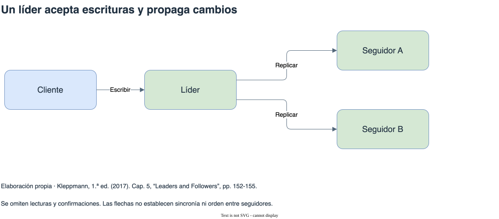

# Replicación

[Índice general](../README.md) · [Glosario](../glosario/README.md)

Fuente exclusiva: Kleppmann, primera edición de 2017. Páginas impresas del libro.

## Índice

- [Copiar datos y sostener garantías](#copiar-datos-y-sostener-garantías)
  - [Qué cambia cuando se agregan lectores](#qué-cambia-cuando-se-agregan-lectores)
- [Un líder y seguidores](#un-líder-y-seguidores)
  - [Sincronía, confirmación y disponibilidad de escritura](#sincronía-confirmación-y-disponibilidad-de-escritura)
  - [Incorporar un seguidor sin perder cambios intermedios](#incorporar-un-seguidor-sin-perder-cambios-intermedios)
  - [Promover una réplica atrasada](#promover-una-réplica-atrasada)
- [Registros y retraso de replicación](#registros-y-retraso-de-replicación)
  - [El formato del registro tiene consecuencias](#el-formato-del-registro-tiene-consecuencias)
  - [Tres experiencias distintas del retraso](#tres-experiencias-distintas-del-retraso)
- [Múltiples líderes y conflictos](#múltiples-líderes-y-conflictos)
  - [Aceptar cambios durante una desconexión](#aceptar-cambios-durante-una-desconexión)
- [Sin líder, quorums y versiones](#sin-líder-quorums-y-versiones)
  - [Qué demuestra la intersección de quorums](#qué-demuestra-la-intersección-de-quorums)
  - [Reparar diferencias y conservar concurrencia](#reparar-diferencias-y-conservar-concurrencia)
- [Diagrama de apoyo](#diagrama-de-apoyo)

## Copiar datos y sostener garantías

Replicar mantiene copias del mismo dato en varias máquinas. El libro enumera objetivos como cercanía geográfica, continuidad ante fallos y distribución de lecturas. Si los datos cambian, el problema incluye cómo propagar cambios y qué pueden observar los lectores mientras las copias difieren.

Replicación y partición resuelven problemas distintos. La primera copia; la segunda divide el conjunto de datos. Pueden combinarse: cada partición puede tener varias réplicas.

Referencia: cap. 5, introducción, pp. 151-152; cap. 6, “Partitioning and Replication”, pp. 200-201.

### Qué cambia cuando se agregan lectores

El líder define un orden de escrituras que los seguidores reproducen. En el esquema del libro, repartir lecturas entre seguidores permite atender más consultas sin enviar todas al líder. Las escrituras siguen pasando por el mismo líder, por lo que agregar lectores no distribuye automáticamente ese trabajo.

Además, cada seguidor debe recibir y aplicar los cambios. Una réplica que atiende consultas costosas puede retrasarse y devolver datos más antiguos. La capacidad de lectura y la frescura de las respuestas deben evaluarse juntas.

La cercanía geográfica reduce el recorrido de una lectura si el dato está en una réplica próxima. Propagar una escritura a otra región agrega comunicación. La ubicación que favorece una consulta puede aumentar el tiempo necesario para confirmar una escritura síncrona.

Referencia: cap. 5, introducción y “Leaders and Followers”, pp. 151-155.

## Un líder y seguidores

En el esquema de líder único, el líder acepta escrituras y transmite cambios a seguidores. Las lecturas pueden utilizar distintas réplicas según las garantías buscadas. Agregar un seguidor requiere una instantánea consistente y continuar desde una posición conocida del registro para no perder cambios.

La replicación síncrona espera una confirmación del seguidor requerido antes de informar éxito. Refuerza la existencia de otra copia, pero puede detener escrituras si ese seguidor no responde. La asíncrona permite continuar sin esperar; si se pierde el líder antes de transmitir ciertos cambios, una promoción puede perder escrituras previamente confirmadas.

El failover promueve un nuevo líder y reconfigura participantes. Debe afrontar retraso, posibles pérdidas y el riesgo de que dos nodos actúen como líder. Un timeout inicia una sospecha, no demuestra por sí solo que el líder anterior dejó de operar.

Referencia: cap. 5, “Leaders and Followers”, “Synchronous Versus Asynchronous Replication”, “Setting Up New Followers” y “Handling Node Outages”, pp. 152-158.

### Sincronía, confirmación y disponibilidad de escritura

En el ejemplo del libro, un seguidor recibe cambios de manera síncrona y otro de manera asíncrona. El líder espera al primero antes de confirmar al cliente. El segundo puede quedar detrás sin detener esa confirmación.

| Modalidad | Qué gana | Qué paga |
| --- | --- | --- |
| Síncrona con un seguidor requerido | Al confirmar, ese seguidor también ha recibido la escritura según el protocolo. | Si no responde, las escrituras que requieren su confirmación deben esperar o fallar. |
| Asíncrona | El líder puede confirmar sin esperar a los seguidores. | Un fallo antes de propagar cambios puede perder escrituras confirmadas al promover otra réplica. |

La copia adicional protege frente a ciertos fallos, dentro de los supuestos del sistema. No equivale a supervivencia frente a cualquier pérdida simultánea ni a cualquier política de promoción. La garantía depende de qué nodos confirmaron y de cuál puede convertirse en líder.

Kleppmann describe la posibilidad de cambiar el seguidor síncrono si queda indisponible. Esa reconfiguración busca conservar otra copia actualizada sin exigir que todos los seguidores respondan a cada escritura. Sigue necesitando un mecanismo que determine qué confirmaciones hacen válida la respuesta al cliente.

Referencia: cap. 5, “Synchronous Versus Asynchronous Replication”, pp. 153-155.

### Incorporar un seguidor sin perder cambios intermedios

Copiar archivos mientras el líder escribe puede producir una imagen inconsistente. El procedimiento del libro usa una instantánea consistente y una posición del registro vinculada a ella.

1. El líder produce la instantánea.
2. El nuevo seguidor copia ese estado.
3. Solicita los cambios posteriores a la posición asociada a la instantánea.
4. Los aplica hasta alcanzar el estado que continúa produciendo el líder.

La posición une la copia inicial con el flujo de cambios. Sin ese punto de referencia, el seguidor podría omitir una escritura que ocurrió durante la copia o repetir cambios de manera incorrecta.

Un seguidor que reinicia también puede recuperar su propio estado y solicitar los cambios pendientes. El problema es más delicado al fallar el líder: hay que seleccionar un reemplazo y redirigir escrituras. Si el líder anterior vuelve y cree que conserva ese papel, aparecen dos autoridades que pueden aceptar cambios incompatibles.

Referencia: cap. 5, “Setting Up New Followers” y “Handling Node Outages”, pp. 155-158.

### Promover una réplica atrasada

El failover enfrenta una decisión con consecuencias para los datos. Si el nuevo líder no recibió algunas escrituras que el anterior ya confirmó, su estado no las contiene. Cuando el viejo líder reaparece, sus cambios no pueden incorporarse sin considerar el orden y los conflictos del nuevo historial.

Un timeout ayuda a iniciar la detección del fallo, pero una demora de red y un proceso detenido pueden parecer iguales desde otro nodo. Un timeout breve acelera la reacción y aumenta las sospechas equivocadas. Uno largo reduce esas reacciones, pero prolonga la espera ante un fallo real.

El libro señala también efectos fuera de la base: una escritura perdida puede haber sido observada por otro sistema. Revertir la copia de la base no revierte automáticamente lo que ese sistema hizo. La recuperación debe considerar las respuestas que ya recibió la aplicación.

Referencia: cap. 5, “Leader failure: Failover”, pp. 156-158.

## Registros y retraso de replicación

El libro distingue replicación de sentencias, de cambios físicos mediante WAL y de cambios lógicos en registros. Reejecutar sentencias exige atender funciones no deterministas; copiar bytes vincula versiones y formatos físicos; un registro lógico puede separar mejor replicación y almacenamiento. Cada alternativa tiene compromisos.

El retraso hace que una réplica asíncrona pueda responder con información antigua. La convergencia eventual supone que los cambios terminan propagándose; no establece por sí sola un plazo máximo.

| Garantía | Qué evita |
| --- | --- |
| Leer las propias escrituras | Que un usuario deje de ver un cambio que acaba de realizar. |
| Lecturas monotónicas | Que lecturas sucesivas del mismo usuario retrocedan a estados anteriores. |
| Lecturas de prefijo consistente | Que se observen efectos antes de sus causas en una secuencia de escrituras. |

El libro ilustra la primera con una actualización del perfil, la segunda con un comentario que aparece y luego desaparece, y la tercera con una conversación cuya respuesta se observa antes de la pregunta.

Referencias: cap. 5, “Implementation of Replication Logs”, pp. 158-161; “Problems with Replication Lag”, pp. 161-168.

### El formato del registro tiene consecuencias

| Registro | Qué transmite | Dificultad que destaca el libro |
| --- | --- | --- |
| Sentencias | Las operaciones que el seguidor debe ejecutar. | Funciones no deterministas y operaciones cuyo resultado depende del estado local. |
| WAL físico | Cambios ligados a la representación interna. | Dependencia de formatos y versiones del motor. |
| Registro lógico | Cambios de filas separados de su representación física. | Necesidad de representar los cambios y aplicarlos correctamente. |

Una sentencia que usa la hora actual puede producir resultados distintos si cada nodo la evalúa por separado. El registro necesita transmitir el resultado apropiado o restringir cómo se ejecuta. Replicar bytes físicos evita repetir esa decisión, pero acopla la replicación al almacenamiento interno.

Referencia: cap. 5, “Implementation of Replication Logs”, pp. 158-161.

### Tres experiencias distintas del retraso

Al actualizar un perfil, el usuario espera ver su propio cambio. Consultar después un seguidor atrasado puede mostrar la versión anterior. Leer las propias escrituras puede requerir enviar ciertas lecturas al líder o esperar a que una réplica alcance la escritura conocida. El costo es restringir qué réplica puede responder o introducir una espera.

En el ejemplo del comentario, una lectura encuentra el comentario en una réplica y la siguiente va a otra más atrasada, donde todavía no existe. Las lecturas monotónicas evitan ese retroceso. Mantener al usuario en una misma réplica es una estrategia descrita en el libro, con dificultades adicionales si hay varios dispositivos o si esa réplica falla.

El ejemplo de la pregunta y la respuesta trata otra anomalía. Si los cambios se replican por caminos distintos, un lector puede recibir la respuesta antes de ver la pregunta. El prefijo consistente conserva el orden causal pertinente. Una sesión que no retrocede no basta por sí sola para resolver dependencias entre diferentes flujos de escritura.

Estas garantías pueden mejorar la experiencia sin exigir que todas las lecturas del sistema vean el último cambio global. Hay que identificar cuál anomalía afecta a la aplicación y qué mecanismo la evita.

Referencia: cap. 5, “Problems with Replication Lag”, pp. 161-168.

## Múltiples líderes y conflictos

Permitir escrituras en varios líderes puede facilitar trabajo en centros de datos separados, operación desconectada y edición colaborativa. La contrapartida es aceptar cambios concurrentes y resolver sus conflictos después.

Seleccionar un ganador descarta otros cambios. Combinar versiones requiere una regla que haga converger las réplicas. El carrito de compras del libro muestra que unir elementos puede conservar agregados pero reintroducir elementos eliminados si la resolución no representa correctamente los borrados.

Referencia: cap. 5, “Multi-Leader Replication”, “Handling Write Conflicts” y “Multi-Leader Replication Topologies”, pp. 168-177.

### Aceptar cambios durante una desconexión

La edición desconectada del libro permite modificar datos localmente y sincronizar después. Cada dispositivo acepta escrituras sin consultar en ese momento una autoridad remota. Al reconectarse, puede encontrar cambios que otro dispositivo hizo sobre los mismos datos.

En varios centros de datos, un líder local reduce la dependencia de una conexión remota para escribir. El problema aparece cuando dos líderes actualizan el mismo dato antes de recibir el cambio del otro. Ambos cambios pueden haber sido aceptados para sus usuarios; descubrir el conflicto después obliga a decidir qué conservar.

Resolverlo eligiendo una versión es sencillo, pero puede descartar una escritura válida. Combinar versiones conserva más información cuando existe una regla apropiada. Esa regla depende del significado del dato: unir elementos del carrito conserva agregados, pero puede recuperar un elemento que alguien había eliminado.

La disponibilidad durante la desconexión se paga con resolución de conflictos posterior. Diferir esa decisión hasta la lectura también traslada complejidad a la aplicación y al usuario. No elimina el conflicto que ya existe.

Referencia: cap. 5, “Multi-Leader Replication” y “Handling Write Conflicts”, pp. 168-175; “Detecting Concurrent Writes”, pp. 184-192.

## Sin líder, quorums y versiones

En el esquema sin líder descrito, el cliente puede escribir y leer varias réplicas. Para una clave con n réplicas, w confirmaciones de escritura y r respuestas de lectura, w + r > n asegura intersección entre esos conjuntos bajo los supuestos del esquema. No demuestra por sí solo linealizabilidad: concurrencia, escrituras parciales y políticas de reparación afectan el resultado.

La reparación durante lecturas actualiza copias atrasadas que se consultan; la anti-entropía busca diferencias en segundo plano. Un sloppy quorum puede usar nodos fuera del conjunto habitual y devolver luego los datos mediante hinted handoff; la intersección habitual ya no está asegurada.

Detectar concurrencia requiere dependencias causales, no solamente marcas de hora. Los vectores de versión ayudan a distinguir versiones derivadas de cambios concurrentes; los tombstones representan borrados que deben sobrevivir a la combinación.

Referencia: cap. 5, “Leaderless Replication”, “Limitations of Quorum Consistency”, “Sloppy Quorums and Hinted Handoff” y “Detecting Concurrent Writes”, pp. 177-192. Las configuraciones de productos son las de la edición de 2017.

### Qué demuestra la intersección de quorums

El ejemplo del libro usa tres réplicas y espera dos confirmaciones para escribir y dos respuestas para leer. Dos conjuntos de dos nodos dentro de los mismos tres tienen al menos un nodo en común. Esa réplica común conecta la escritura con la lectura.

| Parámetro | Qué exige al aumentar | Compromiso |
| --- | --- | --- |
| w, confirmaciones de escritura | Más réplicas deben responder para confirmar. | Más respuestas requeridas pueden impedir escribir ante fallos o demoras. |
| r, respuestas de lectura | La lectura debe obtener más respuestas. | Más respuestas requeridas pueden impedir leer ante fallos o demoras. |

La desigualdad `w + r > n` describe intersección. Para interpretar el resultado también hay que saber cómo se identifican versiones, qué pasa con operaciones concurrentes y si los conjuntos pertenecen al mismo grupo de réplicas.

Si una escritura alcanza algunos nodos pero no reúne w respuestas, puede informarse como fallida y dejar datos en esos nodos. Una lectura posterior podría encontrarlos. El fallo informado al cliente no demuestra que la escritura no tuvo ningún efecto.

Con sloppy quorums, nodos alternativos guardan temporalmente datos cuando los habituales no responden. Eso puede permitir continuar escribiendo, pero las respuestas de lectura del conjunto habitual ya no tienen asegurada la intersección con los nodos que aceptaron esa escritura.

Referencia: cap. 5, “Quorums for reading and writing”, pp. 179-181; “Limitations of Quorum Consistency”, pp. 181-182; “Sloppy Quorums and Hinted Handoff”, pp. 183-184.

### Reparar diferencias y conservar concurrencia

La reparación durante una lectura aprovecha las respuestas de varias réplicas para detectar y actualizar copias atrasadas. Atiende los datos consultados. La anti-entropía examina diferencias en segundo plano y permite reparar también datos que nadie está leyendo. Ambas tareas consumen recursos de comunicación y procesamiento.

Antes de reparar hace falta distinguir atraso de concurrencia. Si una versión deriva de otra, la anterior puede descartarse. Si dos escrituras parten del mismo estado sin conocer la otra, ninguna reemplaza causalmente a su compañera. Los vectores de versión representan esa información y permiten conservar versiones concurrentes para resolverlas.

Elegir por una marca de hora no reconstruye esa relación causal. Además de los problemas de reloj, elimina la versión que no gana. El tradeoff depende de si la aplicación puede tolerar esa pérdida o necesita combinar los cambios.

Referencia: cap. 5, “Read repair and anti-entropy”, pp. 178-179; “Detecting Concurrent Writes”, pp. 184-192.

## Diagrama de apoyo

[Fuente editable](diagramas/lider-seguidores.drawio). Se omiten lecturas y confirmaciones. Las flechas no establecen sincronía ni orden entre seguidores. Referencia: Cap. 5, “Leaders and Followers”, pp. 152-155.

## Continuación de la lectura

[Anterior: Arquitectura de sistemas de datos](../09-arquitectura/README.md) · [Siguiente: Partición](../11-particion/README.md)
