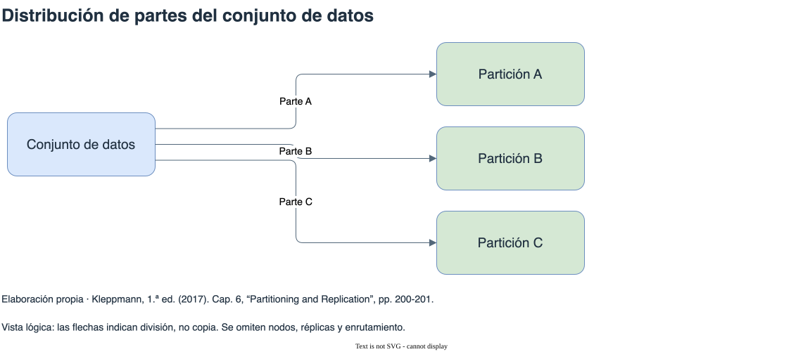

# Partición

[Índice general](../README.md) · [Glosario](../glosario/README.md)

Fuente exclusiva: Kleppmann, primera edición de 2017. Páginas impresas del libro.

## Índice

- [Dividir los datos](#dividir-los-datos)
- [Rango y hash](#rango-y-hash)
- [Una clave muy solicitada](#una-clave-muy-solicitada)
- [Índices secundarios locales y globales](#índices-secundarios-locales-y-globales)
- [Rebalanceo y enrutamiento](#rebalanceo-y-enrutamiento)
- [Diagrama de apoyo](#diagrama-de-apoyo)

## Dividir los datos

La partición distribuye partes de un conjunto de datos para repartir almacenamiento y trabajo. Una consulta restringida a una partición puede resolverse localmente; una consulta que cruza varias requiere coordinación adicional. Cada partición puede replicarse para tolerar fallos.

El objetivo incluye repartir carga, no solamente cantidad de registros. Una partición pequeña puede concentrar solicitudes y convertirse en un punto caliente. En este capítulo, partición significa división deliberada de datos, no interrupción de conectividad entre máquinas.

Referencia: cap. 6, introducción, “Partitioning and Replication” y “Partitioning of Key-Value Data”, pp. 199-202.

## Rango y hash

La partición por rango asigna intervalos contiguos de claves. Facilita recorrer rangos y requiere conocer sus límites para enrutar. El libro la compara con volúmenes de una enciclopedia. Los intervalos no tienen por qué contener la misma cantidad de datos.

El ejemplo de mediciones de sensores muestra un problema: si la clave comienza por tiempo, las escrituras recientes se concentran en el intervalo actual. Incluir el sensor antes del tiempo distribuye dispositivos, pero buscar todas las mediciones del período exige recorrer varios grupos.

El hash transforma la clave para distribuirla con mayor uniformidad. Reduce la cercanía de claves originalmente consecutivas, por lo que pierde ventajas para consultas por rango. Una clave compuesta puede distribuir por una parte y ordenar por otra, como ocurre con publicaciones de un usuario ordenadas por tiempo en el ejemplo del libro.

Referencias: cap. 6, “Partitioning by Key Range” y “Partitioning by Hash of Key”, pp. 202-205.

## Una clave muy solicitada

Distribuir hashes no divide automáticamente el trabajo de una única clave popular. El libro describe agregar un componente aleatorio para repartir escrituras de una clave caliente. El costo aparece al leer: se deben reunir resultados de las partes y decidir para qué claves aplicar el mecanismo.

La distribución debe evaluarse con los accesos reales. Un hash uniforme entre claves no implica carga uniforme si las frecuencias difieren mucho.

Referencia: cap. 6, “Skewed Workloads and Relieving Hot Spots”, pp. 205-206.

## Índices secundarios locales y globales

Un índice local cubre documentos de su partición. Las escrituras mantienen un ámbito acotado, pero buscar un valor secundario sin conocer la clave de partición puede exigir consultar todas las particiones y reunir respuestas. El libro llama scatter/gather a esa distribución de la consulta.

Un índice global organiza términos de todo el conjunto y también debe particionarse. Puede localizar mejor una búsqueda secundaria, a costa de que una escritura modifique índices en otros nodos. Si su actualización es asíncrona, una consulta inmediata puede no reflejar el cambio.

El ejemplo de anuncios de autos muestra ambas organizaciones: indexar localmente el color dentro de cada grupo de documentos o reunir las referencias a autos de un color en la partición correspondiente al término.

Referencia: cap. 6, “Partitioning and Secondary Indexes”, pp. 206-209.

## Rebalanceo y enrutamiento

Rebalancear mueve trabajo entre nodos al cambiar capacidad o distribución. El libro advierte que usar hash(clave) mod N vincula demasiadas asignaciones a la cantidad de nodos: cambiar N puede mover gran parte de los datos.

Las alternativas incluyen mantener muchas particiones y reasignarlas, dividir y combinar particiones dinámicamente, o conservar cierta cantidad por nodo. Mover datos consume recursos. Una reacción automática a un nodo lento puede aumentar su carga y agravar el problema.

Para enrutar, el cliente puede conocer la asignación, un nodo puede reenviar la solicitud o puede existir una capa específica. Todos necesitan información sobre ubicación y cambios. Kleppmann describe servicios de coordinación y difusión entre nodos como alternativas históricas; no añade instrucciones actuales de configuración.

Referencias: cap. 6, “Rebalancing Partitions”, “Strategies for Rebalancing”, “Operations: Automatic or Manual Rebalancing” y “Request Routing”, pp. 209-216.

## Diagrama de apoyo

[Fuente editable](diagramas/particiones.drawio). Vista lógica: las flechas indican división, no copia. Se omiten nodos, réplicas y enrutamiento. Referencia: Cap. 6, “Partitioning and Replication”, pp. 200-201.

## Continuación de la lectura

[Anterior: Replicación](../10-replicacion/README.md) · [Siguiente: Transacciones distribuidas y consistencia](../12-transacciones-distribuidas/README.md)
