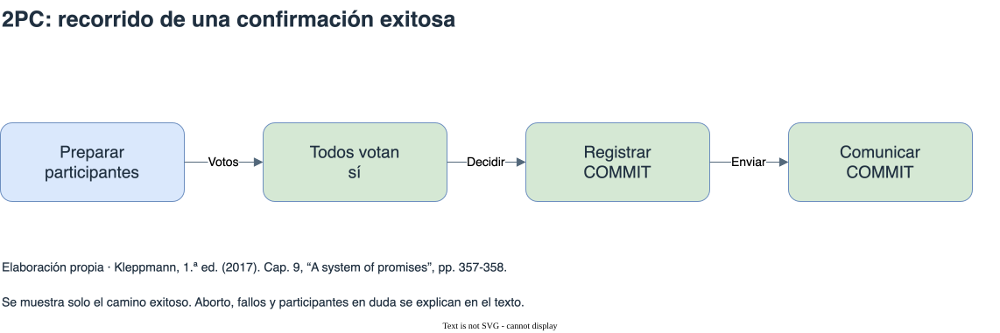

# Transacciones distribuidas y consistencia

[Índice general](../README.md) · [Glosario](../glosario/README.md)

Fuente exclusiva: Kleppmann, primera edición de 2017. Páginas impresas del libro.

## Índice

- [Distinguir las garantías](#distinguir-las-garantías)
- [Linealizabilidad y particiones de red](#linealizabilidad-y-particiones-de-red)
- [Causalidad y orden total](#causalidad-y-orden-total)
- [Compromiso en dos fases, 2PC](#compromiso-en-dos-fases-2pc)
- [Operación y consenso tolerante a fallos](#operación-y-consenso-tolerante-a-fallos)
- [Diagrama de apoyo](#diagrama-de-apoyo)

## Distinguir las garantías

La consistencia eventual permite diferencias temporales entre réplicas; la convergencia por sí sola no dice qué observa una lectura durante ese intervalo. Linealizabilidad, serializabilidad, compromiso atómico y consenso responden a preguntas diferentes.

La linealizabilidad busca que cada operación parezca actuar en un único punto entre su inicio y su respuesta, respetando el orden real de operaciones no superpuestas. La serializabilidad compara transacciones con algún orden serial; no exige por sí sola que ese orden respete el tiempo real. El compromiso atómico determina un resultado conjunto de confirmación o aborto. El consenso permite acordar una decisión propuesta.

Referencias: cap. 9, “Consistency Guarantees”, pp. 322-324; “Linearizability”, pp. 324-330; “Distributed Transactions and Consensus”, pp. 352-354.

## Linealizabilidad y particiones de red

El ejemplo del resultado deportivo muestra un lector que ve el resultado final y otro que, después de conocer esa observación, lee una réplica que aún presenta el partido en curso. La copia atrasada no ofrece la ilusión de un único dato vigente.

La garantía resulta relevante también para restricciones de unicidad, bloqueos y relaciones entre servicios. Bajo una interrupción de red, un sistema que necesita coordinar copias para preservar linealizabilidad puede dejar de atender ciertas solicitudes. Permitir que ambos lados respondan sin esa coordinación puede debilitar la garantía.

Kleppmann explica CAP como una limitación ante particiones de red, no como una elección libre y permanente de dos propiedades entre tres. La partición de red es un fallo de comunicación; la partición del capítulo 6 divide datos deliberadamente.

Referencias: cap. 9, “Relying on Linearizability”, pp. 330-332; “Implementing Linearizable Systems”, pp. 332-335; “The Cost of Linearizability”, pp. 335-339. El ejemplo deportivo pertenece a 2014.

## Causalidad y orden total

Un orden causal conserva dependencias: un efecto debe seguir a las operaciones de las que depende. Operaciones concurrentes pueden no tener un orden causal entre sí. Los relojes lógicos ayudan a expresar orden sin depender exclusivamente de relojes físicos sincronizados.

La difusión con orden total entrega a los participantes los mensajes en un mismo orden y de forma fiable. Asignar números de orden no basta: también hace falta saber qué mensajes anteriores existen y garantizar su entrega. El libro relaciona ese problema con consenso y con la construcción de operaciones linealizables.

Referencia: cap. 9, “Ordering Guarantees”, “Ordering and Causality”, “Sequence Number Ordering” y “Total Order Broadcast”, pp. 339-352.

## Compromiso en dos fases, 2PC

Una transacción distribuida puede necesitar modificar varios participantes. Confirmar cada uno independientemente permite que unos confirmen y otros aborten. 2PC agrega un coordinador y divide la decisión en preparación y resolución.

Durante la preparación, cada participante comprueba que puede confirmar y conserva el estado necesario para cumplir su voto afirmativo. El coordinador decide confirmar si todos pueden hacerlo; de lo contrario, decide abortar. Registra durablemente la decisión antes de comunicarla. Un participante que ya prometió confirmar no puede decidir por su cuenta otro resultado.

Si el coordinador falla después de la preparación, un participante puede quedar en duda y retener recursos mientras espera conocer la decisión. Un timeout no autoriza simplemente a abortar después de votar sí, porque otros participantes podrían haber confirmado. El registro del coordinador forma parte del estado necesario para recuperarse.

Referencia: cap. 9, “Atomic Commit and Two-Phase Commit (2PC)”, “A system of promises” y “Coordinator failure”, pp. 354-359. 2PC aporta compromiso atómico; no reemplaza un mecanismo de aislamiento como 2PL.

## Operación y consenso tolerante a fallos

El libro distingue transacciones distribuidas dentro de una tecnología de transacciones entre sistemas heterogéneos. El ejemplo de un mensaje y una escritura combina confirmar el procesamiento del mensaje con persistir sus efectos. La coordinación cubre participantes que soportan el protocolo; no incorpora automáticamente efectos externos arbitrarios.

XA establece una interfaz de coordinación, pero el estado del coordinador, las transacciones en duda y los bloqueos afectan la operación. Si el coordinador vive en el proceso de la aplicación, esa parte deja de ser completamente descartable: sus registros son necesarios para recuperar decisiones.

El consenso busca acuerdo, integridad, validez y terminación bajo los supuestos del algoritmo. Protocolos como Paxos, Raft y otros descritos en el libro usan épocas y quorums para evitar decisiones incompatibles y avanzar cuando existe una mayoría adecuada. Preservar seguridad puede implicar detener el progreso si falta esa mayoría.

Consenso y 2PC están relacionados, pero no son nombres intercambiables. El compromiso atómico requiere poder confirmar todos los participantes; una decisión ordinaria de consenso puede escoger una propuesta. Los servicios de coordinación usan consenso para sostener decisiones, liderazgo y metadatos, con costos de comunicación y límites de disponibilidad.

Referencias: cap. 9, “Distributed Transactions in Practice”, pp. 360-364; “Fault-Tolerant Consensus”, pp. 364-370; “Membership and Coordination Services”, pp. 370-373. La evaluación de productos corresponde a 2017.

## Diagrama de apoyo

[Fuente editable](diagramas/2pc.drawio). Se muestra solo el camino exitoso. Aborto, fallos y participantes en duda se explican en el texto. Referencia: Cap. 9, “A system of promises”, pp. 357-358.

## Continuación de la lectura

[Anterior: Partición](../11-particion/README.md) · [Siguiente: Persistencia para análisis de datos](../13-analitica/README.md)
