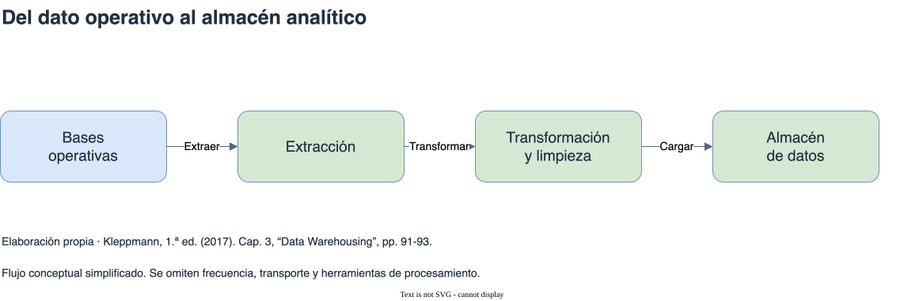

# Persistencia para análisis de datos

[Índice general](../README.md) · [Glosario](../glosario/README.md)

Fuente exclusiva: Kleppmann, primera edición de 2017. Páginas impresas del libro.

## Índice

- [OLTP y OLAP](#oltp-y-olap)
- [Almacenes de datos y ETL](#almacenes-de-datos-y-etl)
- [Hechos y dimensiones](#hechos-y-dimensiones)
- [Almacenamiento por columnas](#almacenamiento-por-columnas)
- [Escrituras y agregados materializados](#escrituras-y-agregados-materializados)
- [Diagrama de apoyo](#diagrama-de-apoyo)

## OLTP y OLAP

OLTP caracteriza el procesamiento habitual de operaciones de la aplicación: búsquedas selectivas y cambios sobre una cantidad acotada de registros. OLAP caracteriza consultas analíticas que recorren muchos registros y producen agregaciones. El libro distingue esos patrones sin reducirlos a motores completamente incompatibles.

Compartir SQL no significa compartir organización física ni objetivos. Un sistema que responde rápidamente a modificaciones individuales puede no estar optimizado para grandes recorridos analíticos. Este capítulo cubre persistencia analítica, según el alcance acordado para Data Science; no incorpora procesamiento por lotes del capítulo 10.

Referencia: cap. 3, “Transaction Processing or Analytics?”, pp. 90-91.

## Almacenes de datos y ETL

Un almacén de datos separa la consulta analítica del trabajo operativo. Reúne datos de distintos sistemas en una estructura adecuada para análisis. El libro describe extracción, transformación y carga, ETL, mediante volcados periódicos o actualizaciones continuas.

La separación permite que consultas costosas no compitan directamente con las operaciones cotidianas. También introduce una copia derivada, cuyo esquema y actualización deben comprenderse. El modelo relacional y SQL son frecuentes en el panorama que describe la edición, pero las estructuras internas difieren de las de una base OLTP.

Referencias: cap. 3, “Data Warehousing” y “The divergence between OLTP databases and data warehouses”, pp. 91-93.

## Hechos y dimensiones

En un esquema estrella, la tabla de hechos representa eventos y contiene medidas y referencias a dimensiones. El ejemplo del libro usa ventas: las medidas permiten agregaciones y las dimensiones aportan contexto como producto, fecha o tienda.

Registrar hechos individuales conserva flexibilidad para consultas posteriores, pero puede generar tablas muy grandes. Las dimensiones permiten interpretar y agrupar los hechos. En un esquema copo de nieve, ciertas dimensiones se subdividen en otras tablas; el agrupamiento lógico y el costo de consultas cambian.

Referencia: cap. 3, “Stars and Snowflakes: Schemas for Analytics”, pp. 93-95. Síntesis del ejemplo de ventas, sin reproducir su esquema.

## Almacenamiento por columnas

Una consulta analítica puede recorrer muchas filas y usar pocos campos. Almacenar los valores de cada columna juntos permite leer solamente las columnas necesarias. Para reconstruir una fila, las posiciones correspondientes deben conservar su correspondencia entre columnas.

El ejemplo que compara ventas de frutas y golosinas según el día de la semana ilustra una agregación que usa una selección limitada de columnas sobre muchos hechos. La organización por filas puede traer datos que la consulta no necesita.

Las columnas también facilitan compresión. El libro presenta bitmaps que indican qué filas tienen un valor determinado y operaciones entre ellos para combinar condiciones. El orden de los datos puede mejorar compresión y acceso, pero no se pueden ordenar columnas independientemente: se perdería la correspondencia de filas.

Referencias: cap. 3, “Column-Oriented Storage”, “Column Compression” y “Sort Order in Column Storage”, pp. 95-101. No se reproduce el código de la consulta.

## Escrituras y agregados materializados

Comprimir y ordenar favorece lecturas, pero dificulta insertar o modificar datos en el medio de estructuras ya organizadas. Kleppmann describe acumular cambios en memoria y combinarlos después con los segmentos, siguiendo principios relacionados con LSM-trees.

Una vista materializada almacena el resultado de una consulta. Un cubo OLAP conserva agregaciones por dimensiones para acelerar ciertos análisis. El beneficio tiene límites: mantenerlo cuesta escrituras y las consultas no previstas pueden necesitar volver a los hechos originales.

La decisión depende de qué trabajo se repite y qué flexibilidad se necesita. El libro también advierte que las familias de columnas de Bigtable, Cassandra y HBase no equivalen al almacenamiento analítico por columnas descrito aquí. Esa comparación conserva su contexto de implementación de 2017.

Referencias: cap. 3, “Writing to Column-Oriented Storage” y “Aggregation: Data Cubes and Materialized Views”, pp. 101-103; recuadro “Column-oriented storage and column families”, p. 99.

## Diagrama de apoyo

[Fuente editable](diagramas/etl.drawio). Flujo conceptual simplificado. Se omiten frecuencia, transporte y herramientas de procesamiento. Referencia: Cap. 3, “Data Warehousing”, pp. 91-93.

## Continuación de la lectura

[Anterior: Transacciones distribuidas y consistencia](../12-transacciones-distribuidas/README.md)
